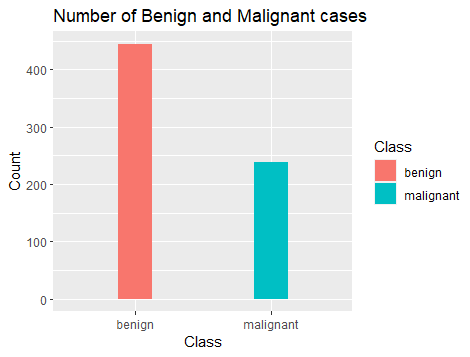
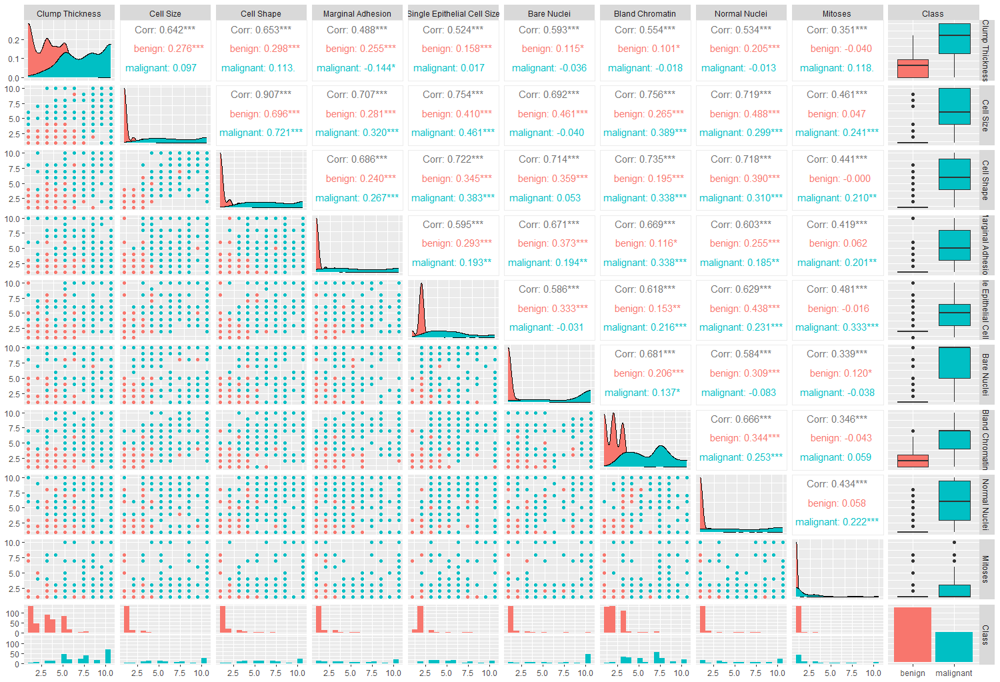
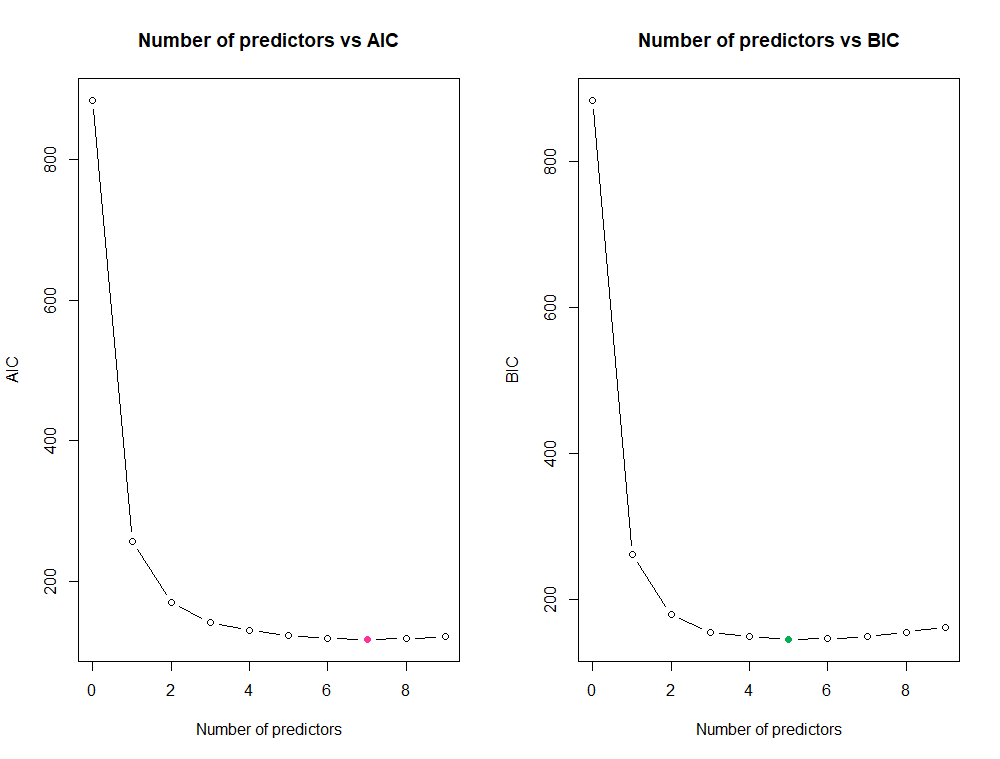
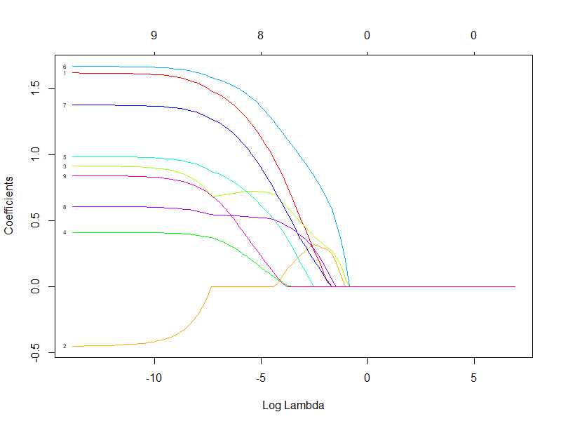

## Data Description
The BreastCancer data consists of the characteristics of breast tissue samples collected from 699 women in Wisconsin using fine needle aspiration cytology. There are nine variables related to the tissue sample's characteristics (See Table below). These features were measured on a scale of one to ten, with one being the healthiest. A unique identifier, represented by *Id*, and a *Class* variable indicating benign or malignant have been provided for each sample.

|Variable|Description|Data Type|
|--------|-----------|---------|
|Id|Unique Identifier for the sample|Character|
|Cl.thickness|Thickness of Clump|Ordered factor|
|Cell.size|Cell Size|Ordered factor|
|Cell.shape|Cell Shape|Ordered factor|
|Marg.adhesion|Marginal Adhesion|Ordered factor|
|Epith.c.size|Cell Size of Single Epithelial|Ordered factor|
|Bare.nuclei|Bare Nuclei|Factor|
|Bl.cromatin|Bland Chromatin|Factor|
|Normal.nucleoli|Normal Nucleoli|Factor|
|Mitoses|Mitoses|Factor|
|Class|Diagnosis of the tumour|Factor|

## Data Cleaning
1. Remove missing or unknown values  
There are 16 unknown values for variable Bare Nuclei, which will be removed before analysis. As a result, the data set now consists of 683 observations of 11 variables.

2. Convert ordered factor variables to a suitable data type  
All the cytological characteristics are ordinal variables ranging from 1 to 10 but are stored as ordered factors in the data set. Hence, they need to be converted to quantitative variables before analysis.

3. Create a binary indicator variable for Class  
A binary indicator variable is created with 0 representing benign and 1 malignant.

4. Normalise dataset  
Normalising the dataset facilitates the comparison of the classifiers built.

## Exploratory Data Analysis
### Number of Benign and Malignant Cases
Out of the 683 observations, we have 444 benign cases, which account for 65% of the total observations. The malignant cases make up the remaining 35% of the total data set, which is equivalent to 239 observations.

### Relationship between predictor variables
From the scatterplot matrix, it is observed that there is a strong positive correlation (0.907) between the predictor variables Cell Size and Cell Shape. In fact, Cell Size has relatively strong correlation with all the predictor variables except for Mitoses variable. Similarly, the same scenario occurs for Cell Shape variable. On the other hand, Mitoses has lower correlation with all the predictor variables.

### Relationship between predictor and response variables
In the last column, the boxplots show that that there is a difference in the range of values for benign and malignant cases. Benign tumour cells tend to have lower values for all the nine variables while the malignant tumour cells are more likely to have higher values. The only exception is for Mitoses variable, whose values are in the same range for benign and malignant cells; we could expect the Mitoses variable to have less influence on the response variable. For the benign cases, we can observe some outliers in the data for most of the predictor variables, and this could lead to prediction errors in the classification.

## Classifiers
We want to build a classifier to predict the diagnosis of the breast tissue, i.e., whether it is malignant or benign, using a subset or all of the nine characteristics. Our predictor variable is Class which is a factor with two levels: benign or malignant. The data has been normalised before modelling to facilitate the comparison of the three different classifiers, namely:
* Logistic Regression with Best Subset Selection
* LASSO Regression
* Bayes classifier for Linear Discriminant Analysis (LDA)

### Logistic Regression with Best Subset Selection
**Best Subset Selection**  
We will select the “best” model by comparing the Akaike information criterion (AIC) and Bayes Information Criterion (BIC) of each model. Minimum value of both information criterion usually indicates better predictive model. The table below provides both values AIC and BIC for each model. Model with 7 predictors achieved the lowest AIC while 5 predictors achieved the lowest BIC.

We choose M6 to be the selected model, since its AIC and BIC are both relatively low, as observed from the figure above, and have little difference with the information criterion values of both  M5 and M7. The three variables which have been dropped out from the model are Cell Size, Single Epithelial Cell Size, and Mitoses. As expected, Cell size has been excluded since it is highly correlated with Cell shape, which is included in the model. As a result, the model would only need one of the two variables. From the correlation matrix, the values for the variable Mitoses are in the same range for both classes, making it difficult to distinguish between the two based on the value of variable Mitoses, which explains why Mitoses has been dropped out.

**Logistic Regression**  
Logistic Regression was conducted with the six variables found in M6, namely: Clump Thickness, Cell Shape, Marginal Adhesion, Bare Nuclei, Bland Chromatin, and Normal Nucleoli. The data set has been split randomly into a 70% training data and a 30% testing data.

|Variable	(Intercept)|Clump Thickness|Cell Shape|Marginal Adhesion|Bare Nuclei|Bland Chromatin|Normal Nucleoli|
|--------------------|---------------|----------|-----------------|-----------|---------------|---------------|
|Estimate|-1.6285|1.8045|1.0699|0.4567|1.5987|1.5371|0.7621|
|P-value|0.000223|0.000720|0.070199|0.330784|0.000412|0.010035|0.053373|

The parameter estimates show that Clump Thickness, Cell Shape, Bare Nuclei and Bland Chromatin are the variables having the most influence on the response variable Y, i.e., the diagnosis. In addition, the parameters estimates are all positive, indicating that the probability of Y assigned to 1 increases as the value of the variables increases. On the other hand, the p-value of Marginal Adhesion is quite high which means that same could have been removed from the model. This can also be seen from its parameter estimate value of 0.4567 which is lowest among the predictor variables, showing that it has the least influence.

|| Predicted||
|--------|----------|-|
|**Observed**|**0**|**1**|
|**0**|130|3|
|**1**|7|63|

The test error, 0.049, of the model shows that approximately 95% of predictions are accurate. From the confusion matrix, we can deduce that 7 malignant observations were classified as benign, while 3 benign diagnosis were classified as malignant.

### LASSO Regression
In the LASSO regression, the same training and testing data set as in logistic regression were used, which will facilitate comparison of models. Firstly, a LASSO regression has been performed using the whole data for a range of values of λ, the tuning parameter. From the figure below, as λ increases, Cell Size is the first variable to be dropped out, followed by Mitoses, Marginal Adhesion, and so on.  

To find out the optimal value of λ, a 10-fold cross-validation was used to fit the LASSO regression with different values of λ. The value of λ which minimises mean square error is 0.01. A LASSO regression was fitted using this specific value and the training data, and the model was then used to predict the test data.

As per the parameter estimates, the LASSO regression consists of eight variables as Cell Size has been dropped out. As shown in correlation matrix, Cell Size is strongly positively correlated with Cell Shape, and hence, the model does not require both of the variables. The parameter estimates are positive for all predictor variables, showing that the probability of classifying the observation as malignant increases with higher values of the predictor variables.

| |Variables|Estimate|
|-|---------|--------|
||(Intercept)|- 1.26299|
|x1|Clump Thickness|1.03032|
|x2|Cell Size|0.00000|
|x3|Cell Shape|0.70962|
|x4|Marginal Adhesion|0.09953|
|x5|Single Epithelial Cell Size|0.54638|
|x6|Bare Nuclei|1.29513|
|x7|Bland Chromatin|0.79957|
|x8|Normal Nucleoli|0.51511|
|x9|Mitoses|0.15087|

The test error is 0.059, showing that the model is around 94% accurate in its prediction. From the confusion matrix, 4 benign cases were wrongly classified as malignant, and 8 malignant cases were wrongly classified as benign.
|| Predicted||
|--------|----------|-|
|**Observed**|**0**|**1**|
|**0**|129|	4|
|**1**|	8	|62|

### Bayes Classifier for Linear Discriminant Analysis (LDA) 
The Bayes Classifier for LDA is built using the Best Subset Selection i.e., M6: Clump Thickness, Cell Shape, Marginal Adhesion, Bare Nuclei, Bland Chromatin, and Normal Nucleoli. 

**Results of LDA**  
The prior probabilities and means of the groups (0 being benign and 1 being malignant) are given by:

|Class|Prior Probabilities|Clump Thickness|Cell Shape|Marginal Adhesion|Bare Nuclei|Bland Chromatin|Normal Nucleoli|
|-----|-------------------|---------------|----------|-----------------|-----------|---------------|---------------|
|0|0.64792|-0.50671|-0.60136|-0.53451|-0.60657|-0.56759|-0.53664|
|1|0.35208|0.97601|1.15950|0.97437|1.19509|1.05502|1.05645|

Since the probability of a malignant case in the population is unknown, we cannot specify the prior probabilities. The ones chosen by the LDA function are an indication of the proportion of benign and malignant cases in the data set.

Looking at the group means in original scaling, we can see a clearly difference between the means of benign and malignant tumours. For benign cases, the means are on the lower side (from a minimum of 1 to a maximum of 3) whereas for malignant cases, the means are much higher, ranging from 5 to nearly 8).

|Class|Clump Thickness|Cell Shape|Marginal Adhesion|Bare Nuclei|Bland Chromatin|Normal Nucleoli|
|-----|---------------|----------|-----------------|-----------|---------------|---------------|
|0|3.012862|1.107521|2.135718|2.731181|1.204253|2.130491|
|1|6.132120|7.769692|5.844116|6.786862|7.389016|6.094675|

The test error obtained is 0.074, and consequently, we can say that the model is around 93% accurate in the classification. From the confusion matrix, 3 observations have been wrongly classified as malignant and 12 observations wrongly classified as benign.
|| Predicted||
|--------|----------|-|
|**Observed**|**0**|**1**|
|**0**|	130	|3|
|**1**|	12|	58|

  
## Comparison of the classifiers
From the results above, the classifier with better predictive performance is the Logistic Regression with Best Subset Selection (test error = 0.049),  followed by LASSO Regression (test error = 0.059) and then, Bayes classifier for LDA (test error = 0.074). However, the test results are based on a single train set and test set. For better comparison, we will apply a 10-fold cross validation to compute an average test error for each classifier, which will be used to compare the predictive performances. For the comparison to be fair, we will use the same 10 partitioning for the three methods, and the model M6, for Logistic Regression and Bayes Classifier for LDA.

|Classifier|Test Error (MSE)|Accuracy (%)|
|----------|----------------|------------|
|Logistic| Regression|	0.0380|	96.2|
|LASSO Regression|	0.0223	|97.8|
|Bayes Classifier for LDA|	0.0395	|96.1|

Since we have used the 10-fold cross validation on the test error, we notice that the test errors have decreased in value for all three classifiers. The LASSO Regression achieved better predictive performance with 97.8% accuracy, followed by Logistic Regression and Bayes Classifier for LDA. These two remaining classifiers have approximately same accuracy in predictions. Nonetheless, the Logistic Regression with Best Subset Selection and Bayes Classifier for LDA have both 96% accuracy in their predictions using only 6 predictor variables, while the LASSO regression achieved a higher accuracy using 8 predictor variables.

The “best” classifier based on the test error will be the LASSO Regression. However, if we are to consider the number of predictor variables used, we can say that the “best” classifier would be the Logistic Regression with the Best Subset Selection. The latter achieved nearly the same accuracy with 6 variables instead of 8, as in the LASSO Regression. Additionally, having less predictor variables usually reduces the variance in the parameter estimates, and consequently leads to a better predictive performance.
